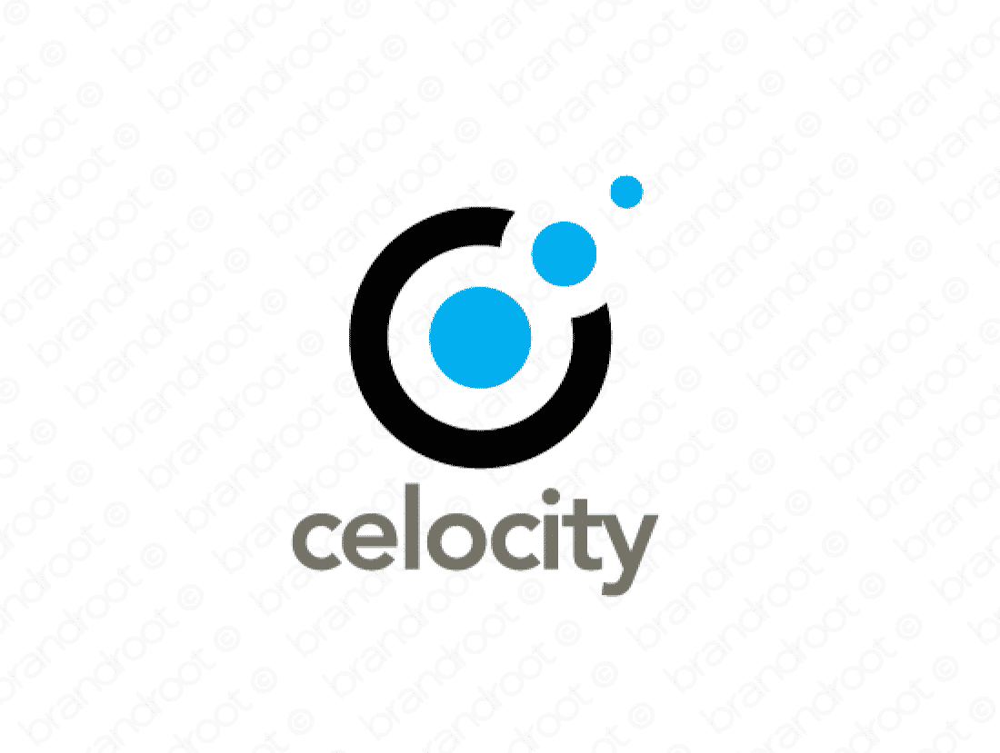

# celocity
A perfect name for a company in the cellular industry, this name will provide identity and brand recognition. Let customers know what you are all about.

## Branding


** A perfect name for a company in the cellular industry, this name will provide identity and brand recognition. Let customers know what you are all about.**

**Link:** ```https://www.brandroot.com/names/celocity```

# Tecnology
    Elixir
    Phoenix
    Mysql
    Docker
    Html5
    CSS3
    Javascript

# Stack
    App
        - React + antd(css)

    Backend
        - Phoenix + Mysql

    Engine Developer / Production
        - Docker

# Developer Methodology
    - Agile
        - Scrum + Kanbam


# Scope
## Pitch
    O Cliente (cidadão) poderia dar votos na camera sobre projetos votados pois os mesmo não conseguem está no local pois é no horário comercial.
    Os cidadões poderiam vê as pautas da camera antes da votação e se pronunciar sobre aquilo dando sua opinião e seu voto a favor ou contra.
    A prefeitura teria uma forma de coletar dados da população com base na sua prioridade de "querer".


## Sistema
    * Cliente / Governo
        - Cliente
            O cadastro pode ser feito pelo o site com alguns campos.
                status - boolean
                nome - string(255)
                email - boolean
                point - integer - quantidade pontos para a capacidade de selos.
                cpf - string(14)
                invict - String(15) - Hash gerado na hora de criar o usuário.

        - Projetos
            O cadastro de projetos podem ter varias pautas os campos de projetos são.
                status - boolean
                avatar - string(255)
                nome - string(255)
                descrição - long

        - Pauta
            O cadastro da pauta pode ter um projeto vinculado a ele.
                status - boolean
                description - string(255)

        - Votação
            Cada cliente(população) poderea votar na pauta informando e colocar uma comentário do seu voto, poder ser privado ou publico.
                private - boolean
                user_id - Cliente modelo
                inf_favor - boolean (true || false) - True caso ele seja favor e false caso não.
                comment - Comentário sobre sua votação  (não é obrigatóro esse campo)

        - Selo
            Cada Cliente(população) teria um selo de partipação sobre as pautas e projetos votados assim ganhando pontuação.
            O cliente(população) só ganha ponto a medida do voto e seu comentario.
                Selo Ouro - 3000 Pontos
                Selo Bronze - 1000 Pontos
                Selo Prata - 500 pontos
            Cada votação vale um ponto caso o cliente convide algum pessoa ganha 2 pontos no ato do cadastro.

        - Acesso Administrativo
            O administrador (governo) poderá saber quem votou em votos publicos e comentarios para analise de votos na camera.
            O administrador (governo) pode criar projetos e pautas e visualizar clientes com selos e votações.
                


